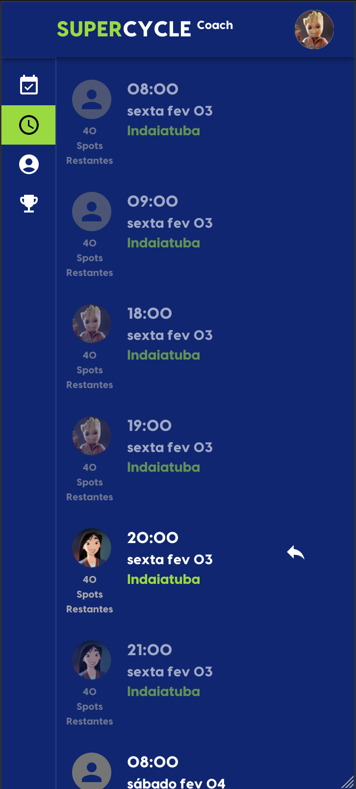
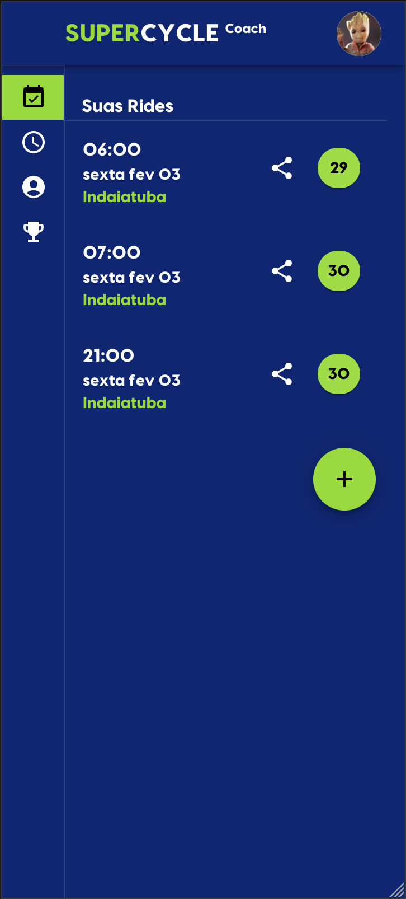
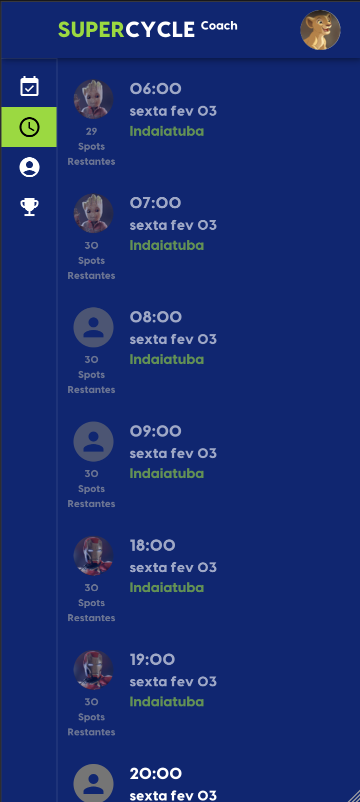
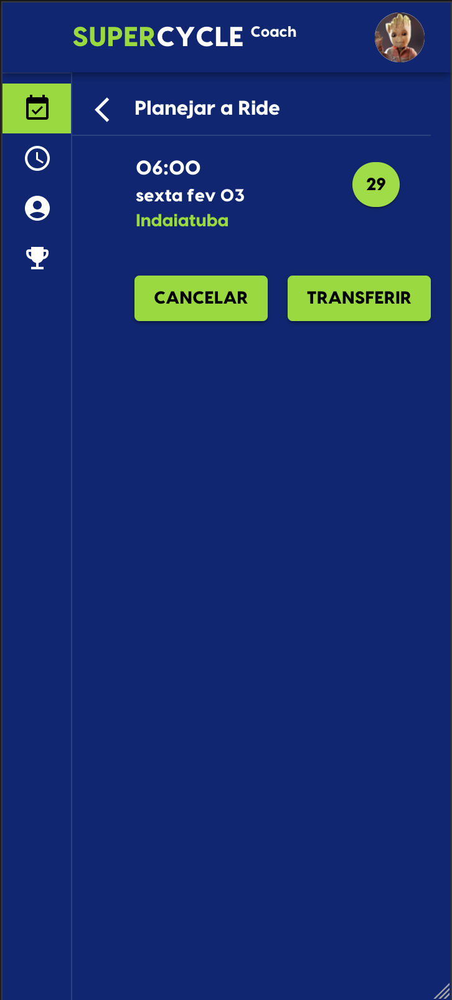
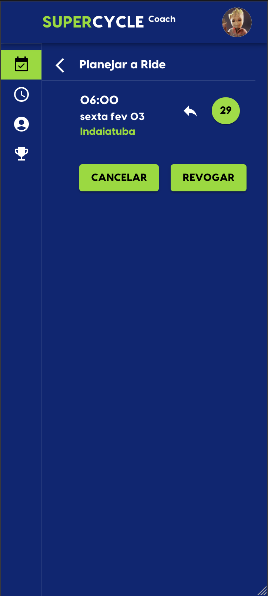
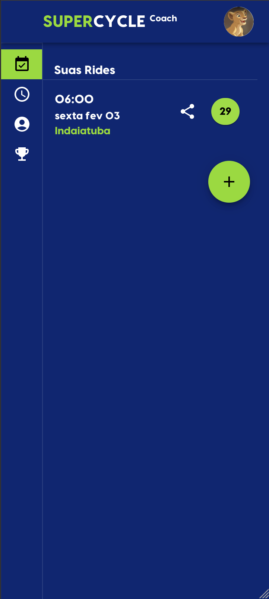
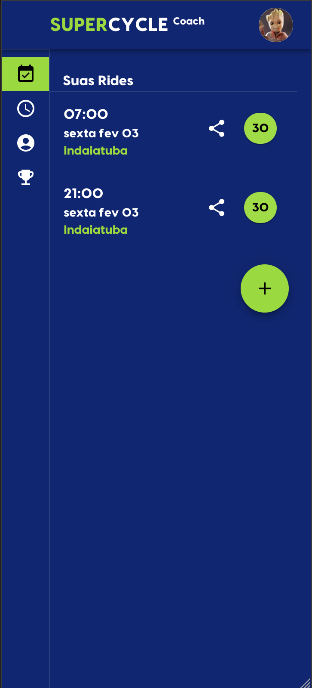

# #115 - Como Coach, quero poder transferir meu Ride para outro Coach quando não puder Coach o Ride que planejei <br>
# 📥 📤
# #125 - Como Coach, quero poder ver os Rides planejados de outros Coaches para poder ver quem está antes/depois de mim
# 📋 🔍

Duas coisas mudaram:

1. Nova visualização de lista: A visão geral dos horários do Studio usada para planejar Rides
2. Agora você pode oferecer seus Rides para transferência para outro Coach

### 1. Nova visualização de lista

Na lista de seleção de Rides, você agora vê todos os Rides futuros, aqueles que foram planejados e não planejados.

#### Rides & Tempos indisponíveis para seleção

Escolhemos uma janela de planejamento de 48 horas, ou seja, você não pode planejar um Ride dentro de um
tempo inicial mais curto do que essas 48 horas. Isso é para permitir que os Riders reservem seu Spot.
Não é considerado justo se um Coach pode planejar um Ride com algumas horas de antecedência, sem ter nenhum Riders
mas ainda receber as recompensas. Esta janela é uma forma de evitar isso. Esses horários não estão disponíveis para seleção.

Todos os horários que foram planejados por outros Coaches estão indisponíveis para seleção.

#### Rides & Tempos disponíveis para seleção

Rides futuros não planejados com mais de 48 horas estão disponíveis para planejamento.

Quando um Coach marcou uma Ride para transferência, essa Ride também estará disponível para planejamento.



### 2. Transferência de Ride

Para acomodar os Coaches que não conseguem cumprir o compromisso de Coaching a Ride, adicionamos o botão "Transferir".

Uma transferência funciona em duas etapas:

1. Marcar Ride como transferível
2. Qualquer Coach pode aceitar a transferência

Para ajudar o Coach a divulgar a transferência, ele pode usar o botão de compartilhamento no mesmo
maneira de usar isso para chamar a atenção de Riders em potencial.
Neste exemplo seria usado para chamar a atenção de outros Coaches.

```
  Observe no exemplo o passeio que Groot planejou para sexta fev 3, 06:00
  e como ele fica indisponível pela primeira vez e se torna disponível na 
  lista quando transferível
```

<table>
 <tr> 
    <td> <b>1. Rides de Groot</b> </td>
    <td> <b>2. Ride não disponível</b> </td>
    <td> <b>3. Groot quer transferir</b> </td>
    <td> <b>4. Ride marcado (aparece uma seta)</b> </td>
 </tr>
 <tr>
    <td></td>
    <td></td> 
    <td></td> 
    <td></td> 
 </tr>
 <tr>
    <td> <b>5. Ride disponível</b> </td>
    <td> <b>6. Simba aceita</b> </td>
    <td> <b>7. Simba ganha o Ride</b> </td>
    <td> <b>8. Groot Perdeu o Ride</b> </td>
 </tr>
 <tr>
    <td></td> 
    <td></td> 
    <td></td> 
    <td></td>
 </tr>
</table>


