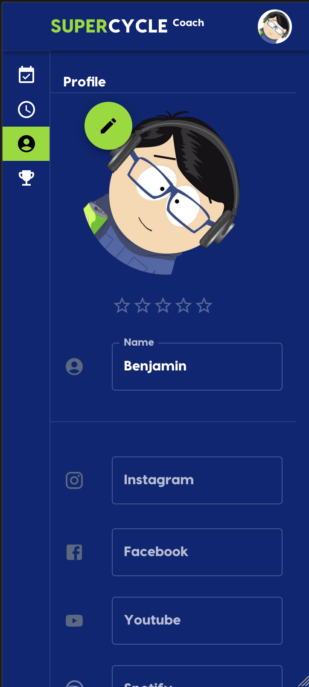

# 122 - Como Coach, quero poder editar (cortar, mover) minha foto de perfil carregada para ter mais controle sobre sua aparência

# 📷🤳

## Selfie-Esteem

Uma vez que pretendemos promover os nossos Coaches em todo o lado, também é importante a sua aparência!

Para acomodar uma maneira mais controlada do Coach em seu perfil, adicionamos algumas funcionalidades extras para
ajustar seu
imagem antes de salvar.

Você pode:

- Move (mover)
- Rotate (girar)
- Zoom (ampliação)

sua imagem carregada antes de salvá-la como sua foto de perfil.

<table>
 <tr> 
    <td> <b>Perfil</b> </td>
    <td> <b>Selecione editar Imagem</b> </td>
    <td> <b>Selecione nova Imagem</b> </td>
 </tr>
 <tr>
    <td></td>
    <td></td>
    <td></td>
</tr>
 <tr> 
    <td> <b>Zoom, Rotate, Move</b> </td>
    <td> <b>Zoom, Rotate, Move</b> </td>
    <td> <b>Salvar nova Imagem</b> </td>
 </tr>
<tr>
    <td></td>
    <td></td>
    <td></td>
</tr>
</table>
