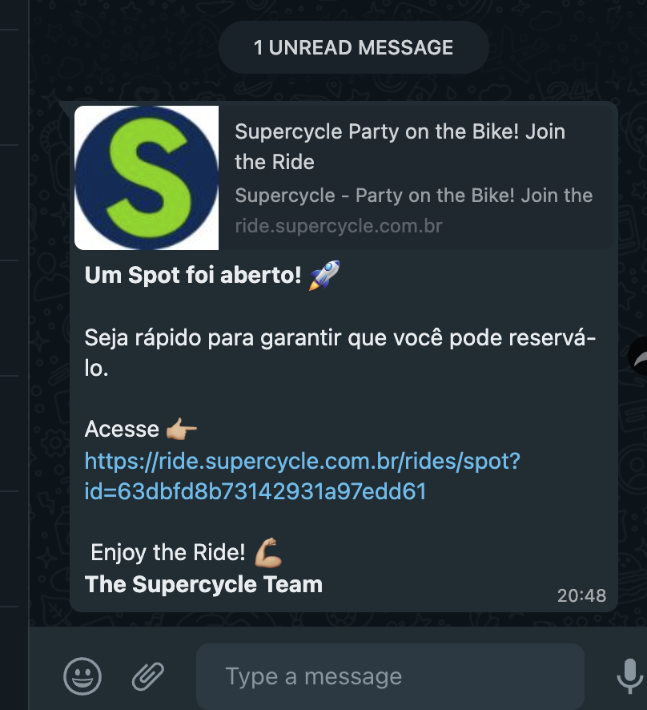
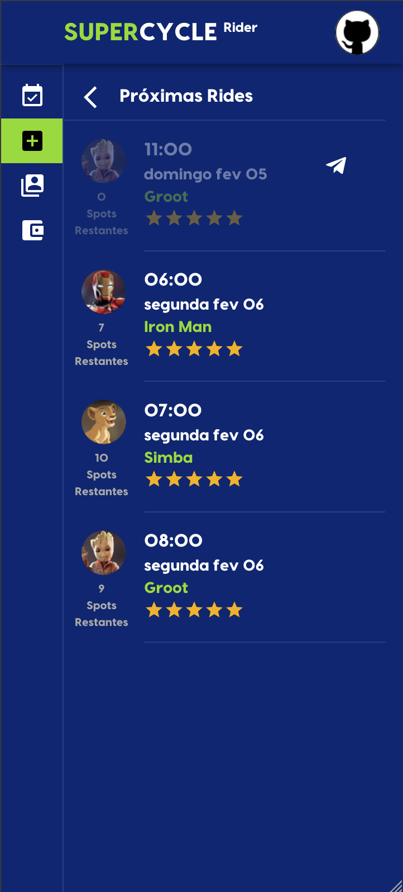
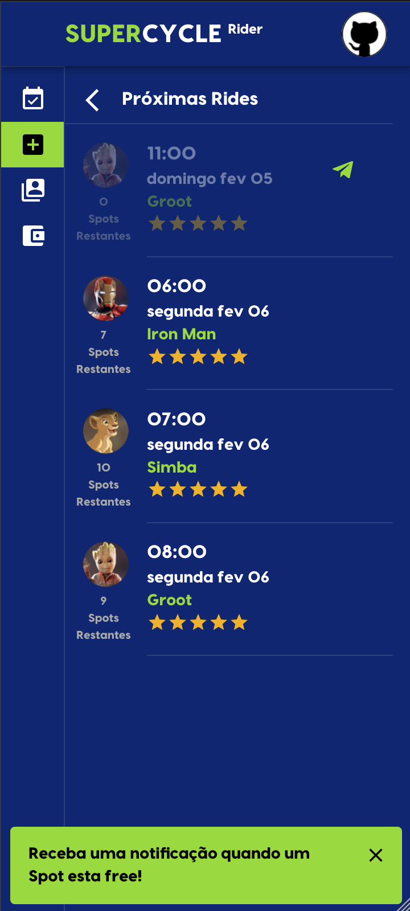
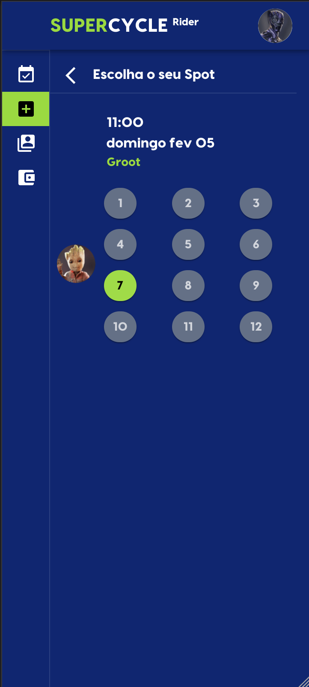
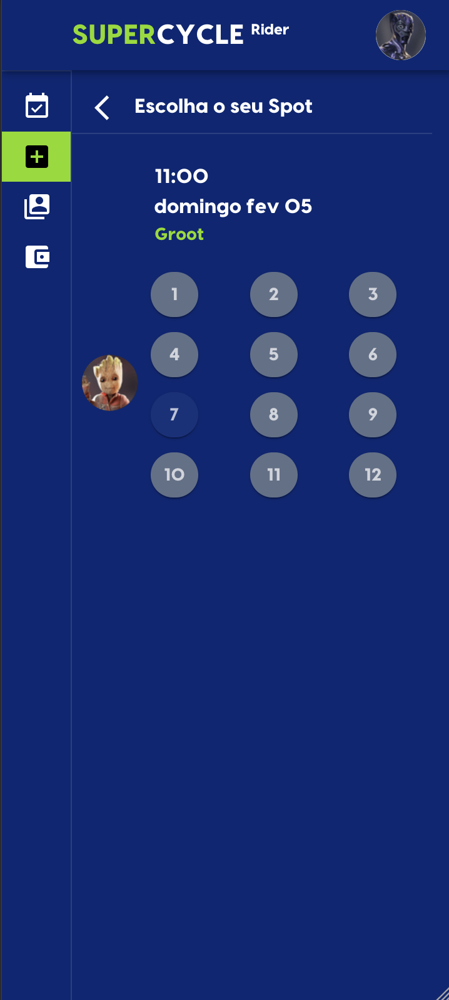

# 46 - Como Rider, quero poder subscrever um serviço de notificação quando um Ride estiver cheio, para que eu possa ser notificado quando um Rider cancelar e um Spot

# 🚨 😁

##

Os Riders podem assinar um serviço de notificação quando um Ride está cheio.
Quando um Spot on the Ride é liberado, os Riders que se inscreveram receberão uma mensagem de WhatsApp com o link para
reservar seu Spot.

 
 

**Os passos:**

1. Quando um Ride está cheio, mostramos "acinzentado" e adicionamos o ícone de
   notificação 
2. O Rider se inscreve para ser notificado clicando neste ícone
3. Quando um Spot é liberada, enviamos a mensagem do WhatsApp para todos os Riders da lista de notificações

 
Temos uma política de primeiro a chegar, primeiro a ser servido.
Optamos por não usar uma lista de espera, mas um serviço de notificação para manter todas as 
chances iguais para os Riders conseguirem um Spot

<table>
 <tr> 
    <td> <b>Ride cheio</b> </td>
    <td> <b>Inscreve para ser notificado</b> </td>
    <td> <b>Spot ocupado</b> </td>
    <td> <b>Spot liberado</b> </td>
 </tr>
 <tr>
    <td></td>
    <td></td>
    <td></td>
    <td></td>
</tr>
</table>
