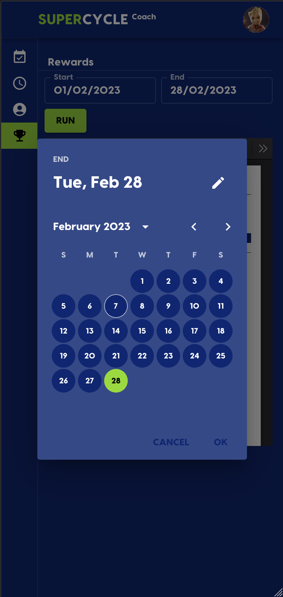

# 85 - Como Coach, quero ter uma visão geral dos Rides que fiz para entender quanto dinheiro ganhei

# 📈💰

##

Um Coach pode selecionar uma data de início e término que retornará todas as Rides Coached naquele período.

Um resumo é criado como a primeira página e nas páginas subseqüentes os detalhes do Ride são adicionados.

O PDF é renderizado em um leitor de PDF totalmente funcional com recursos como download, etc.

<a href="ride-rewards.pdf">Example PDF</a>

 
<table>
 <tr> 
    <td> <b>Data de início</b> </td>
    <td> <b>Data final</b> </td>
    <td> <b>Resumo</b> </td>
    <td> <b>Detalhes</b> </td>
 </tr>
 <tr>
    <td></td>
    <td></td>
    <td></td>
    <td></td>
</tr>
</table>
