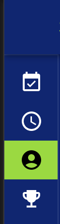

# #93 - Como Coach, quero poder adicionar meus canais de mídia social ao meu perfil para aumentar o alcance de meus Riders
# 📸
Você pode adicionar seus links de mídia social na página de perfil. Clique no ícone do perfil no menu para ir até lá.



Os canais disponíveis são:

- Instagram
- Facebook
- YouTube
- Spotify Playlist
- Tik tok

Somente quando você preencher um valor o link ficará visível para os Riders. 
Assim, você pode escolher quais canais deseja usar e quais não.

Você só precisa preencher o "handle" do perfil. Exemplos:

```
   (Veja as screenshots abaixo)
   
   Instagram url : https://www.instagram.com/supercyclebrasil/ 
   Apenas adicionar : supercyclebrasil
   
   Facebook url : https://www.facebook.com/supercyclebrasil 
   Apenas adicionar : supercyclebrasil
   
   Youtube url : https://www.youtube.com/@supercyclebrasil
   Apenas adicionar : @supercyclebrasil
   
   Spotify url : https://open.spotify.com/playlist/7tHA1hHsjEuRqj6hDlVwLL
   Apenas adicionar : 7tHA1hHsjEuRqj6hDlVwLL
   
   Tik Tok url : https://www.tiktok.com/@supercyclebrasil
   Apenas adicionar : @supercyclebrasil
```

<table>
 <tr> 
    <td> <b>Coach</b> </td>
    <td> <b>Rider</b> </td>
 </tr>
 <tr>
    <td></td>
    <td></td> 
</tr>
</table>


